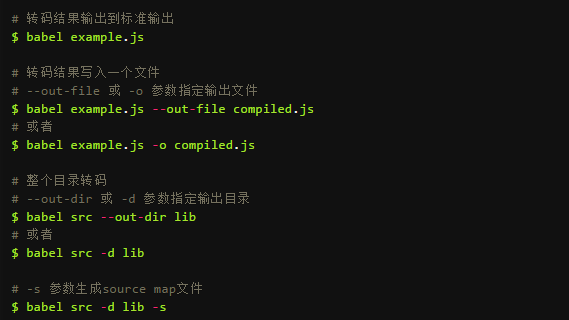
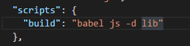

####一、es6编译
#####1.1babel-cli
+ 使用babel，配置.babelrc(参考http://es6.ruanyifeng.com/#docs/intro)
+ 使用babel-cli命令行转码
+ npm install -g bable-cli
+ 使用如下：
+ 
+ 可以把babel-cli安装在项目之中 npm install --save-dev babel-cli
+ 再改写pageage.json的script如
+ 
+ 这样执行：npm run build就会把js文件夹下的es6编译为es5到lib的文件夹下

#####1.2babel-register
+ babel-register模块改写require命令，为它加上一个钩子。此后，每当使用require加载.js、.jsx、.es和.es6后缀名的文件，就会先用Babel进行转码
+ npm install --save-dev babel-register
+ 使用时，必须首先加载babel-register
+ require("babel-register");
+ require("./filename.js");
####二、ES6声明变量的方法
+ var,function,let，const,import,class
+ let、const、class声明的全局变量不属于顶层对象的属性，即es6开始，全局变量逐步与顶层对象的属性脱钩。

####三、字符串的扩展
+ 原本js只有indexOf方法来确定一个字符串是否在另一个字符串内，es6又增加了三个方法
+ includes()：返回布尔值，表示是否找到了参数字符串
+ startsWith()：返回布尔值，表示参数字符串是否在源字符串的头部
+ endsWith()：返回布尔值，表示参数字符串是否在源字符串的尾部
+ 模板字符串：可以当做普通字符串，也可以多行字符串，也可以嵌入变量，所有的空格和换行都会默认保存