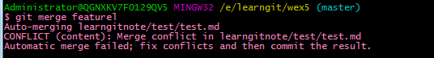
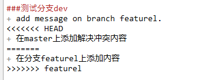
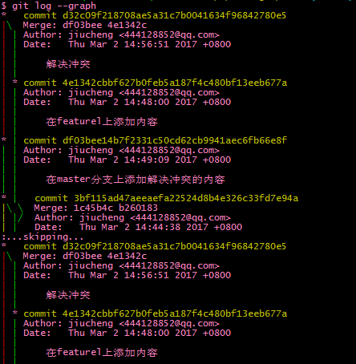
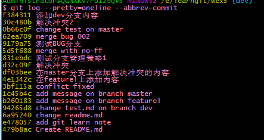
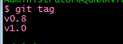
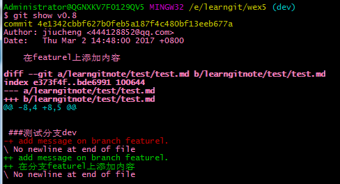

####一、git版本控制系统
+ git init初始化仓库，自动创建一个.git文件监视该仓库
+ mkdir flodName创建文件夹

####二、添加到git仓库需要2步
+ 1、git add file 添加文件
+ 2、git commit -m '本次提交的注释'

###三、常用命令
+ ls 查看当前仓库下面都有什么
+ pwd 查看当前仓库的名字
+ git status查看当前仓库状态(是否有文件改动)
+ git diff查看改动后新加的内容
+ git log [--pretty=oneline]查看所有的提交信息
+ git checkout -- file放弃工作区的修改，没有--就是切换到另一个分支了
+ rm filename 删除文件(命令行删除还是手动删除都要重新add/commit)
+ 如果误删还没commit可以git checkout -- filename恢复文件

###四、版本退回
+ 先git log看看最近的提交信息（如有ABC三次提交）
+ 当前在C：git reset --haed HEAD^回退到上一个版本B(回头退之后再git log看看提交信息是否少一次提交)
+ 当前回退到了B：git reset --hard 7cc99041be2d如果想回到版本C怎么办(当前命令行一直没关闭是可以的)，7cc99041be2d是版本C提交时候的id的前一段
+ <b>注意</b>：git reflog在命令行关闭后如何查看所有的提交id

### 五、版本回退总结
+ git reset --hard commit-id在版本历史之间穿梭
+ git log可以查看提交历史
+ git reflog查看历史命令(重返未来)

###六、工作区(Working Directory)和暂存区(Stage)
+ Git的版本库里存了很多东西，其中最重要的就是称为stage（或者叫index）的暂存区，还有Git为我们自动创建的第一个分支master，以及指向master的一个指针叫HEAD。
+ 
+ 其实第一步是用git add把文件添加进去，实际上就是把文件修改添加到暂存区；
+ 第二步是用git commit提交更改，实际上就是把暂存区的所有内容提交到当前分支。
+ 在git commit成功之后暂存区就是空白了，被默认推送到git自动创建的master分支上了

###七、关联远程仓库
+ 一般都是先建立远程再clone到本地
+ shh(速度更快)协议个https协议(每次push都要求输入口令)

###八、分支管理
####8.1 创建并合并分支
+ git branch dev创建分支dev
+ git checkout dev切换到分支dev
+ git checkout -b dev创建分支dev并切换到分支dev(相当于2条命令)
+ **注意**在分支dev上的修改并提交后，切换回原来分支master是看不到你在dev分支上面的修改的
+ **如何合并呢？？？**
+ git merge dev合并指定分支到当前分支(合并后会mater分支会看到dev改动后的内容)
+ Fast-forward实质上是把master指向dev的当前最新提交所以速度很快
+ **成功合并后，dev分支就可以删除了**
+ git branch -d dev
+ **因为创建、合并和删除分支非常快，所以Git鼓励你使用分支完成某个任务，合并后再删掉分支，这和直接在master分支上工作效果是一样的，但过程更安全。**

####小结：Git鼓励大量使用分支：
+ 查看分支：git branch
+ 创建分支：git branch <name>
+ 切换分支：git checkout <name>
+ 创建+切换分支：git checkout -b <name>
+ 合并某分支到当前分支：git merge <name>
+ 删除分支：git branch -d <name>

####8.2、解决冲突
+ 不同分支上对相同的文件都做了修改并add/commit之后合git merge name会报错
+ 
+ 打开冲突的文件如下
+ 
+ 选择一个重新add/commit就可以了
+ 此时就可以删除多余的分支了
+ git branch -d name
+ 上面命令之后可以git branch查看分支是否被删除
+ 工作结束

####小结
+ 当Git无法自动合并分支时，就必须首先解决冲突。解决冲突后，再提交，合并完成。
+ 用git log --graph命令可以看到分支合并图如下(只截一点)。
+ 

####8.3、分支管理策略
+ fast forward合并策略看不到有合并的历史记录
+ git merge --no-ff -m "merge with no-ff" dev（使用--no-ff合并分支dev重新提交带提交注释信息）
+ **在实际开发中，我们应该按照几个基本原则进行分支管理：**
+ 首先，master分支应该是非常稳定的，也就是仅用来发布新版本，平时不能在上面干活；那在哪干活呢？干活都在dev分支上，也就是说，dev分支是不稳定的，到某个时候，比如1.0版本发布时，再把dev分支合并到master上，在master分支发布1.0版本；你和你的小伙伴们每个人都在dev分支上干活，每个人都有自己的分支，时不时地往dev分支上合并就可以了。

####小结
+ Git分支十分强大，在团队开发中应该充分应用。
+ 合并分支时，加上--no-ff参数就可以用普通模式合并，合并后的历史有分支，能看出来曾经做过合并，而fast forward合并就看不出来曾经做过合并。

###九、BUG分支
+ 正在分支dev上‘作战’而且还没完成(没法提交)，有个紧急bug需要修复
+ 幸好，Git还提供了一个stash功能，可以把当前工作现场“储藏”起来，等以后恢复现场后继续工作：
+ git stash(也就是修改后没add/commit的时候，**可以理解为临时托管所**)
+ git checkout master:切换到主分支master
+ git checkout -b issue-001:在master分支上在创建一个bug分支如：issue-001
+ 在issue-001上把BUG修复后并add/commit
+ git checkout master:切换到master分支并：git merge --no-of -m 'merged bug 001' issue-001
+ git branch -d issue-001 合并后删除issue-001 BUG分支
+ **此时修复好了**
+ git checkout dev 切换dev分支继续‘作战’
+ **git stash list**就能看到之前自己没有add/commit信息
+ **如何恢复？？2个办法**
+ 1、git stash apply 恢复，但是恢复后，stash内容并不删除，你需要用git stash drop来删除；
+ 2、另一种方式是用git stash pop，恢复的同时把stash内容也删了

####小结
+ 修复bug时，我们会通过创建新的bug分支进行修复，然后合并，最后删除；
当手头工作没有完成时，先把工作现场git stash一下，然后去修复bug，修复后，再git stash pop，回到工作现场。

####十、feature分支
+ 正在dev分支上开发，BOSS需要一个新功能，此时应该在dev分支上床架一个小分支如git checkout -b feature01 创建并切换到分支feature01
+ 在feature01上完成功能之并git add/commit之后
+ git checkout dev 切换到dev分支**准备合并**
+ 此时BOSS又说不要这个功能了(其实你内心是奔溃的)，虽然白干了，但是这个分支还是得销毁
+ **因为还没合并就要销毁**此时 git branch -d feature01是会报错的
+ git branch -D feature01 强行删除
+ 就OK了

####小结
+ 开发一个新feature，最好新建一个分支；
+ 如果要丢弃一个没有被合并过的分支，可以通过git branch -D <name>强行删除。

###十一、多人协作
+ 当你从远程仓库克隆时，实际上Git自动把本地的master分支和远程的master分支对应起来了，并且，远程仓库的默认名称是origin。
+ git remote 查看远程信息
+ git remote -v 查看远程origin地址，没有推送权限就看不到push地址
+ **推送分支**
+ 推送分支，就是把该分支上的所有本地提交推送到远程库。推送时，要指定本地分支，这样，Git就会把该分支推送到远程库对应的远程分支上
+ git push origin master
+ 如果要推送其他分支如：dev
+ git push origin dev
+ 但是，并不是一定要把本地分支往远程推送，那么，哪些分支需要推送，哪些不需要呢？
	+ master分支是主分支，因此要时刻与远程同步；
	+ dev分支是开发分支，团队所有成员都需要在上面工作，所以也需要与远程同步；
	+ bug分支只用于在本地修复bug，就没必要推到远程了，除非老板要看看你每周到底修复了几个bug
	+ feature分支是否推到远程，取决于你是否和你的小伙伴合作在上面开发。
	+ 就是在Git中，分支完全可以在本地自己藏着玩，是否推送，视你的心情而定！
+ **抓取分支**
+ 多人协作时，大家都会往master和dev分支上推送各自的修改
+ 当别人clone你的仓库默认只能看到本地的master主分支，如果需要在dev分支上进行开发，**就必须创建远程的dev分支到本地，如何创建呢？？**
+ git checkout -b dev origin/dev
+ 现在就可以在dev分支上继续修改，然后把dev分支push到远程如：
+ git add/commit
+ git push origin dev**此时如果有人比先提交了内容到dev**你这里会报错！**如何解决？？**
+ **解决办法就是先pull到本地合并解决冲突再push**
+ 如果pull失败了是因为没有指定本地的dev分支与远程的origin/dev分支的连接，根据提示设置dev和origin/dev连接：
+ git branch --set-upstream dev origin/dev
+ 再pull，这回git pull成功，但是合并有冲突，**如果合并有冲突需要手动解决冲突**，解决后再add/commit，再push
#####所以：多人协作的工作模式通常是这样：
+ 1、首先，可以试图用git push origin name推送自己的修改；
+ 2、如果推送失败，则因为远程分支比你的本地更新，需要先用git pull试图合并；
+ 3、如果合并有冲突，则解决冲突，并在本地提交；
+ 4、没有冲突或者解决掉冲突后，再用git push origin bname推送就能成功！
+ **注意**如果git pull提示“no tracking information”，则说明本地分支和远程分支的链接关系没有创建，用命令git branch --set-upstream name origin/name。

####小结
+ 查看远程库信息，使用git remote -v；
+ 本地新建的分支如果不推送到远程，对其他人就是不可见的；
+ 从本地推送分支，使用git push origin branch-name，如果推送失败，先用git pull抓取远程的新提交；
+ 在本地创建和远程分支对应的分支，使用git checkout -b branch-name origin/branch-name，本地和远程分支的名称最好一致；
+ 建立本地分支和远程分支的关联，使用git branch --set-upstream name origin/name；
+ 从远程抓取分支，使用git pull，如果有冲突，要先处理冲突。

###十二、标签
+ 发布一个版本时，我们通常先在版本库中打一个标签（tag），这样，就唯一确定了打标签时刻的版本。将来无论什么时候，取某个标签的版本，就是把那个打标签的时刻的历史版本取出来。所以，标签也是版本库的一个快照。

+ Git的标签虽然是版本库的快照，但其实它就是指向某个commit的指针（跟分支很像对不对？但是分支可以移动，标签不能移动），所以，创建和删除标签都是瞬间完成的。
+ Git有commit，为什么还要引入tag？
+ “请把上周一的那个版本打包发布，commit号是6a5819e...”
+ “一串乱七八糟的数字不好找！”
+ 如果换一个办法：
+ “请把上周一的那个版本打包发布，版本号是v1.2”
+ “好的，按照tag v1.2查找commit就行！”
+ 所以，tag就是一个让人容易记住的有意义的名字，它跟某个commit绑在一起。

####如何创建标签
+ 在Git中打标签非常简单，首先，切换到需要打标签的分支上
+ 如切换到dev分支并创建一个标签：git checkout dev
+ git tag v1.0 然后，敲命令git tag <name>就可以打一个新标签
+ git tag 可以用命令git tag查看所有标签
+ 默认标签是打在最新提交的commit上的，**如果之前的一次提交忘记打怎么办？**方法是找到历史提交的commit id，然后打上就可以了
+ git log --pretty=oneline --abbrev-commit 可以看到之前的commit-id如下图
+ 
+ 如果想对："在featurel上添加内容"这次提交打上标签改，它对应的commit-id是：4e1342c,即可在命令行输入:git tag v0.8 4e1342c
+ 再次输入:git tag 就会看到刚刚追加的tag
+ 
+ **注意**标签不是按时间顺序列出，而是按字母排序的。可以用git show <tagname>查看标签信息
+ 用命令git show <tagname>可以看到说明文字如：git show v0.8
+ 
+ 还可以通过-s用私钥签名一个标签(过于复杂略)

####总结
+ 命令git tag <name>用于新建一个标签，默认为HEAD，也可以指定一个commit id；
+ git tag -a <tagname> -m "blablabla..."可以指定标签信息；
+ git tag -s <tagname> -m "blablabla..."可以用PGP签名标签；
+ 命令git tag可以查看所有标签。