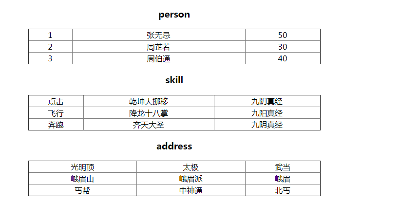

### PHP notes
+ PHP在Web开发中的应用
	+ 搜集表单数据
	+ 生成动态网页
	+ 字符串处理
	+ 动态输出图像
	+ 服务器文件操作系统
	+ 编写数据库支持的网页
	+ 会话控制
	+ 处理XML文件
	+ 支持大量的网络协议
	+ 服务器端的其他操作
+ 第一个PHP脚本程序


```javascript

	//PHP代码
	<html>
	    <head>
	        <title>測試PHP，類似html</title>
	        <!--添加樣式-->
	        <style>
	            body{
	                background:#72C586;
	            };
	        </style>
	    </head>
	    <body>
	        <!--添加JS腳本-->
	        <script>
	            document.write(new Date());
	        </script>
	        <!--添加PHP腳本-->
	        <div class="main">
	            <!--会被服务器解析之后-->
	            <?php
	                for($i=0;$i<5;$i++)
	                    echo "$i *****<br>";
	            ?>
	        </div>
	        <!---->
	        <div class="text" style='color:<?php echo "#e4393c"?>'>
	            <?php
	                $count=100;
	                $str="我是PHP生成的！！";
	                echo $str.$count;
	            ?>
	        </div>
	    </body>
	</html>

```

+ PHP语言标记:可以在php.ini内修改
	+ 1、标准<code> 开始标记：<?php 结束标记：?></code>
	+ 2、短风格
	+ 3、asp风格
	+ 4、javascript风格
+ 指令分隔符“分号”
	+ 1、功能执行语句后要加，离结束标记最近的可以不需要分号
	+ 2、结构定义的语句后不需要
+ 程序中的注释
	+ 1、<code>//单行注释</code>
	+ 2、<code>/**/ 多行注释</code>
	+ 3、<code>#脚本注释</code>
	+ 4、<code>/** */文档注释</code>
+ 在程序中使用空白
	+ 建议一个PHP脚本省略结束标记：?>

### 一、基础
+ phpinfo();//能够看到PHP的详细信息，(配置文件在Loaded Configuration File	)

### 二、PHP脚本程序
+ 编写一个.php文件
+ 上传到web服务器的根目录下
+ 通过浏览器访问Web服务器管理下的PHP文件，就可以运行PHP文件
+ 在PHP文件种可以编写HTML、CSS、JAVASCRIPT等语言，但是使用起始标记：<code><?php 这里 ?></code>之间的代码用PHP服务器解析，将解析之后的代码发到客户端浏览器，在这个标记之外的直接发送到客户端，客户端再用浏览器解析。

#### 三、变量的声明
+ $变量名=值
+ 强类型语言(c,java)，声明之前一定要先指定类型
+ PHP是弱类型语言，变量的类型由值决定
+ 声明和使用都要用$符号
+ 不能以数字开头
+ 不能使用PHP的运算符号<code>+-*%&</code>
+ PHP可以使用系统关键字作为变量名
+ PHP变量区分大小写，(只有变量和常量区分)
+ 变量名字要有意义，单词或拼音

```javascript

	<?php
		$a=10;
		$t=true;
		$s="string";
		echo $s
	?>

```
+ Isset();

#### 四、变量的引用赋值
+ 1、变量的引用赋值，需要"&"放在引用变量的前面

#### 五、变量的类型(8):var_dump($var);判断类型
+ 4种标量
	+ 整型:int、integer
	+ 布尔型：bool、boolean
	+ 浮点型：float、double、real
	+ 字符串：string
+ 2种符合类型
	+ 数组：array
	+ 对象:object
+ 2种特殊类型
	+ 资源类型：resource
	+ 空类型:null

```javascript

	$int=10; //十进制的声明
	$int=042;//八进制的声明
	$int=0xff;十六进制的声明

	$float=10;

	//以下都是false的情况
	$bool=false;
	$bool=0;
	$bool=0.000;
	$bool="";
	$bool=" ";
	$bool=null;
	$bool="0";

	//字符串的声明
	//1、单引号和双引号都可以声明字符串
	$str="xxx";
	$str='xxx';
	//2、声明的字符串没有长度限制
	//3、在双引号中即可以直接解析变量，又可以直接使用转义字符
	$var=10;
	$str= "xzczx $var gfg $var";
	$str="xxx($var)xxx$(var)";
	//4、在单引号的字符串中，不可以解析变量，也不可以使用转义字符
	//5、在双引号中不能再使用双引号，在单引号中不能使用单引号
	//6、最好使用单引号(节省系统资源减少解析)
	//7、定界符号声明字符串(大量字符串)，name是自定义的名字
	$str=<<<name
			这里随便放。。。。。。。很多

	


	name;//这里要顶格
	$str=`dir`;

```

#### 六、数据类型转换
+ 数据类型之间的相互转换
	+ 一种是强制转换
		+ setType(变量,类型)，原类型转换
		+ $var=(int)"13131cxzc";生成新的，原类型不变
		+ $变量=intval(变量或值);
		+ $变量=floatval(变量或值);
		+ $变量=stringval(变量或值);
		+ 注意：整型在内存中占4个字节，浮点型在内存中占8个字节
	+ 一只能够是自动转换：常用方式
+ 与变量和类型有关的常用函数
	+ isset()
	+ empty()
	+ unset()
	+ setType()
	+ getType()

+ 变量类型测试函数
	+ is_bool();
	+ is_int() is_integer() is_long()
	+ is_string();
	+ is_float(),is_double() is_real()
	+ is_array()
	+ is_object()
	+ is_resource()
	+ is_null();
	+ is_scalar()
	+ is_numberic()
	+ is_callable()

### 七、常量的声明与使用
+ 1、常量是一个简单值的标识符
+ 2、定义之后不能改变它的值，也不能使用unset()取消
+ 3、常量可以不用理会变量范围的规则而在任何地方都可以定义、访问
+ 4、常量使用：<code>define("常量名字",值)</code>
+ 5、常量声明在声明和使用都不使用"$"
+ 6、常量名字习惯大写
+ 7、常量的值只能用标量类型(int,float,bool,string)
+ 8、常量移动要在声明时就给值
+ 9、defined("常量")//是否存在

#### 八、预定义常量和魔术常量

```javascript

	echo __FILE__;
	echo __LINE__;
	echo __FUNCTION__;

```

### 运算符号(PHP)操作符
+ ！(非)
+ 按运算符号的功能区分
	+ 1、算数运算符
		+ % 整除运算，控制范围。不要用小数和负数
		+ ++、--
	+ 2、字符串运算符:<code> .  </code>
	+ 3、赋值运算符：<code>=,-=,+=,/=,%=,.=</code>
	+ 4、比较运算符:<code>>,<,<=,>=,==,===,!=,!==</code>
	+ 5、逻辑运算符:<code>&&(and)，||(or),!(not)</code> 
		+ 只能操作bool型的值，返回的也是bool型的值
	+ 6、位运算符 :<code>&,|,~ ,^</code>
	+ 7、其他		:<code>?:  ,``,-> </code>

```javascript

    // 判断闰年
    // $year=2017;
    $year=2016;
    if(($year%4==0&&$year%100!=0)||$year%100==0){
        echo "是闰年 <br>";
    }else{
        echo "不是闰年 <br>";
    }

    // ++、--
    $a=10;
    $a++;   //$a=$a+1;  先用变量再自增1
    ++$a;   //$a=$a+1;  先自增1再用变量
    $a--;   //$a=$a-1;  先用变量再自减1
    --$a;   //$a=$a-1;  先自减1再用变量

    $a=10;
    $b=$a++;    //b=10 ,a=11
    // echo $b;
    $c=--$b;    //c=9, b=9
    // echo $c;

    $d=$c++ + ++$c;     //$c++:先用9，$c=10,++$c:先自增1再用，$c=11,d=9+11=20,
    $e=$d-- - --$d;     //$d--:d=19,--$d:d=18,e=20-18
    echo $e."<br>";


```

### 九、循环结构
+ 1、while
+ 2、do-while
+ 3、for(初始化;循环条件;增量){循环体}

### 十、函数
+ 定义：函数是一个呗命名的独立的代码段，它执行特定任务，并可以给调用它的程序返回一个值
+ 函数的声明
+ 带参数的函数(形参和实参的区别)

### 十一、变量的范围
+ 局部变量：在函数中声明的变量就是局部变量，只能在自己的函数内部使用，函数执行完毕变量被释放。
+ 全局变量：在函数外声明，在变量声明以后的直到脚本结束前都可以使用
+ PHP的变量**分不出是声明还是使用**，在PHP中使用全局变量要通过**globa**l关键字将这个全局变量包括到函数中才能使用到。在global声明之后才是使用全局变量
+ 参数就是局部变量，这个局部变量可以调用时去赋值

```javascript

	<?php
		$a=10;
		function test(){
			global $a;
			$a+=10;
			echo $a;
		}
		
		function demo(){
			global $a;
			$a+=5;
			echo $a;
		}
		echo $a;
```

### PHP的静态变量
+ 静态变量只能声明在函数中，不能声明在全局，使用static在变量前
+ 作用：一个变量可以在同一个函数在多次调用中同用
	+ 1、静态变量再静态代码段中保存
	+ 2、一个函数多次调用之间公用，但是在第一次调用函数时声明到内存，就不再声明而直接使用

```javascript
	
	<?php
		function test(){
			static $a=0;
			$a++;
			echo $a;
		}

	//变量函数：如果一个变量后面有括号，$var=hello;$var(),就会寻找与变量值同名的函数
	function one($a,$b){
		return $a+$b;
	}
	
	function two($a,$b){
		return $a-$b;
	}

	$var=one;
	//$var="two";
	echo "$var(3,4)";


	/*
	*1、函数的功能-----决定是否使用这个函数
	*2、函数的参数-----决定函数怎么调用。有几个参数，传什么类型的值
	*3、函数的返回值---调用后怎么处理这个函数
	*PHP系统给了2000多个函数，都可以使用函数名直接使用
	*
	*
	*
	*
	*
	*/

	
	//1、函数参数带[]可以选
	function test($a,$b,$c=10){
		echo $a+$b+$c;
	}
	test(1,2);
	//2、带...表示可以传任意个参数
	//3、带callback的表示传回调函数的

```


### 十二、函数


```javascript

	<?php
	/*
	*1、内部函数：PHP可以在函数内部声明函数，目的就是在函数内部使用，就是用来帮助*外部函数完成一些功能的
	*
	*2、递归函数：就是在自己内部调用自己的函数名
	*
	*
	*
	*3、重用函数：(使用自己定义的函数库)
	*require
	*include
	*require_once
	*include_once
	*include(文件名);
	*include '文件名';
	*
	*
	*
	*4、一些系统函数的使用：
	*
	*
	*/

	function demo($num){
		echo	$num.'<br>';
		if($num>0){
			demo($num-1);
		}else{
			echo '---------<br>';
		}
		echo $num."<br>";
	}
	demo(10);

```

### 十三、数组
+ 1、数组的概述
	+ 1：数组的本质，管理和操作一组变量，成批处理
	+ 2：数组是复合类型
	+ 3：数组中可以存储任意长度的数据，也可以村塾任意类型的数据
	+ 4：数组就可以完成其它语言数据结构的功能(链表，队列，栈，集合类)
	+ 5：
+ 2、数组的分类
	+ 一维数组，二维数组，三维数组，多维数组
	+ 索引数组：下标书顺序整数作为索引的
	+ 关联数组：下标是字符串作为索引

+ 3、数组多种声明方式
	+ 1、直接为数组元素赋值
		+ 索引不给默认索引从0开始
		+ 如果给出索引下标，下一次就会从最大的开始+1
		+ 如果后面出现前面的下标，如果是赋值就是为前面的元素重新赋值
	+ 2、使用array()函数
		+ 默认是索引数组
		+ 如果为关联数组和索引数组指定下标使用：<code>=></code>
		+ 使用
	+ 3、使用其它的函数声明file();

### 十四、数组的遍历
+ 1、使用for循环遍历
	+ a:其它语言
	+ b:PHP中不是首选的方式
	+ c:数组必须是索引数组，而且下标还必须是连续的(索引数组下标还可以不连续，数组还有关联数组)
+ 2、使用foreach语句遍历(通常选择它)
	+ foreach(数组遍历 as 变量值){循环体}
	+ a:循环次数由数组的元素个数决定
	+ b:每一次循环都会将数组中的元素分别赋值给后面的变量

```javascript

	<?php
		$user=array(1,"name":"张三","age":20,"sex":"男");
		foreach($arr as $var){
	        echo $var."<br>";
	    }

		foreach($arr as $key=>$var){
	        echo $key."=====>"."$var"."<br>";
	    }
		//遍历多维数组
		 $userarr=array(
	        "person"=>array(
	            array(1,'张无忌','50'),
	            array(2,"周芷若","30"),
	            array(3,"周伯通",'40')
	        ),
	        "skill"=>array(
	            array('点击','乾坤大挪移','九阴真经'),
	            array('飞行','降龙十八掌','九阳真经'),
	            array('奔跑','齐天大圣','九阴真经'),
	        ),
	        "address"=>array(
	            array('光明顶','太极','武当'),
	            array('峨眉山','峨眉派','峨眉'),
	            array('丐帮','中神通','北丐')
	        )
	    );
	    foreach($userarr as $tableName=>$table){
	        echo '<table border=1 width="600" align="center" style="text-align:center;border-collapse:collapse;">';
	        echo '<caption><h3>'.$tableName.'</h3></caption>';
	            foreach($table as $row){
	                echo '<tr>';
	                    foreach($row as $col){
	                        echo '<td>'.$col.'</td>';
	                    }
	                echo '</tr>';
	            }
	        echo '</table>';
	    }
		//输出如下图

```

+ 
+ 3、使用while(),list(),each()组合函数遍历数组
	+ each()函数
		+ a:需要一个数组作为参数
		+ b:返回来的也是一个数组
		+ c:返回来的数组是0,1,key,value四个下标，0和key是键，1和value是当前的值
		+ d:默认当前元素就是第一个元素;
		+ e:每执行一次后就会将当前元素向后移动一次;
		+ f:如果到最後的元素再執行這個函數，則就会返回false;

	```javascript
	
		<?php
			$arr=array("id"=>1,"name"=>"张无忌","age"=>21,"sex"=>"男");
		    $var=each($arr);
		    print_r($var);//Array ( [1] => 1 [value] => 1 [0] => id [key] => id )
	
	
	```

	+ list()函数
		+ a:list()=array()需要将一个数组赋值给这个函数
		+ b:数组中的元素个数要和list()函数中的参数个数相同
		+ c:数组中的每个元素值会赋值list()函数中的每个参数，list()将每个参数转为变量。
		+ d:只能接受索引数组

	```javascript
		
		list($id, ,$age,$sex)=array(1,'张无忌','30','男');
	    echo $id."<br>";
	    // echo $name."<br>";
	    echo $age."<br>";
	    echo $sex."<br>";


	```
